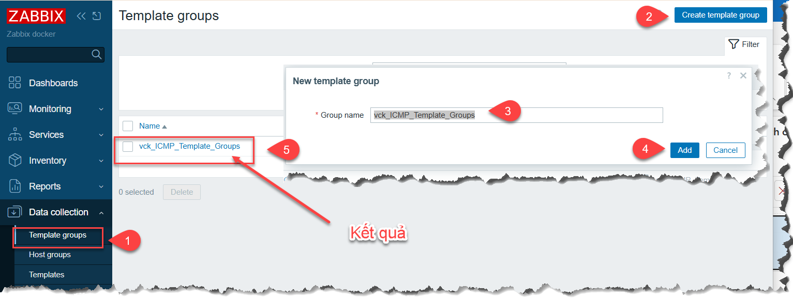
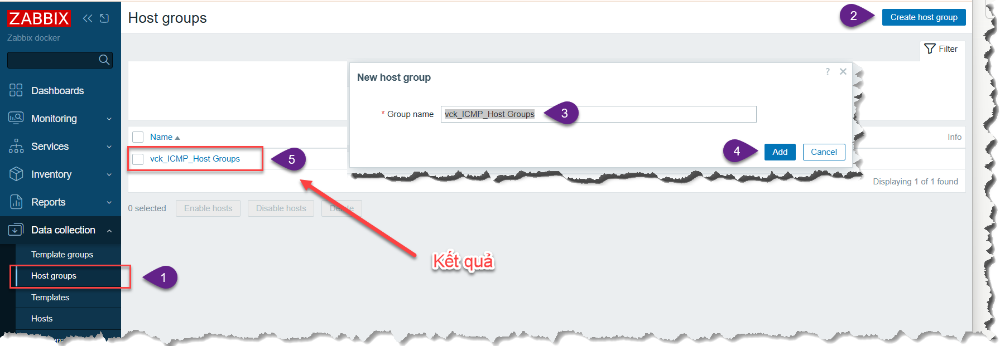
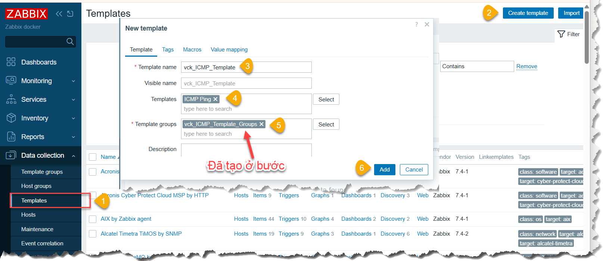
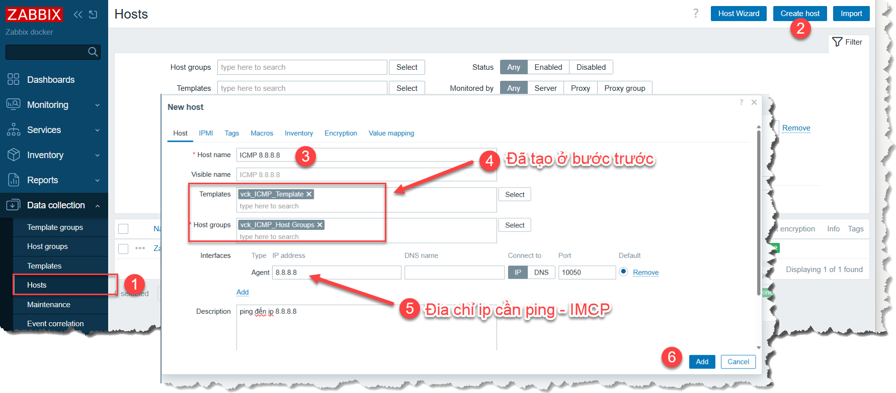
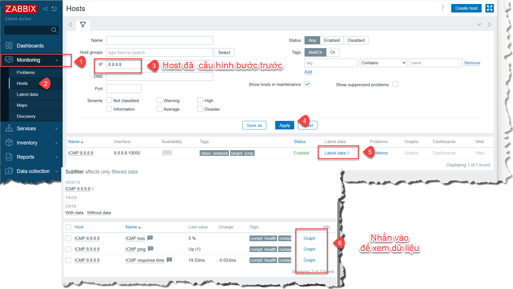
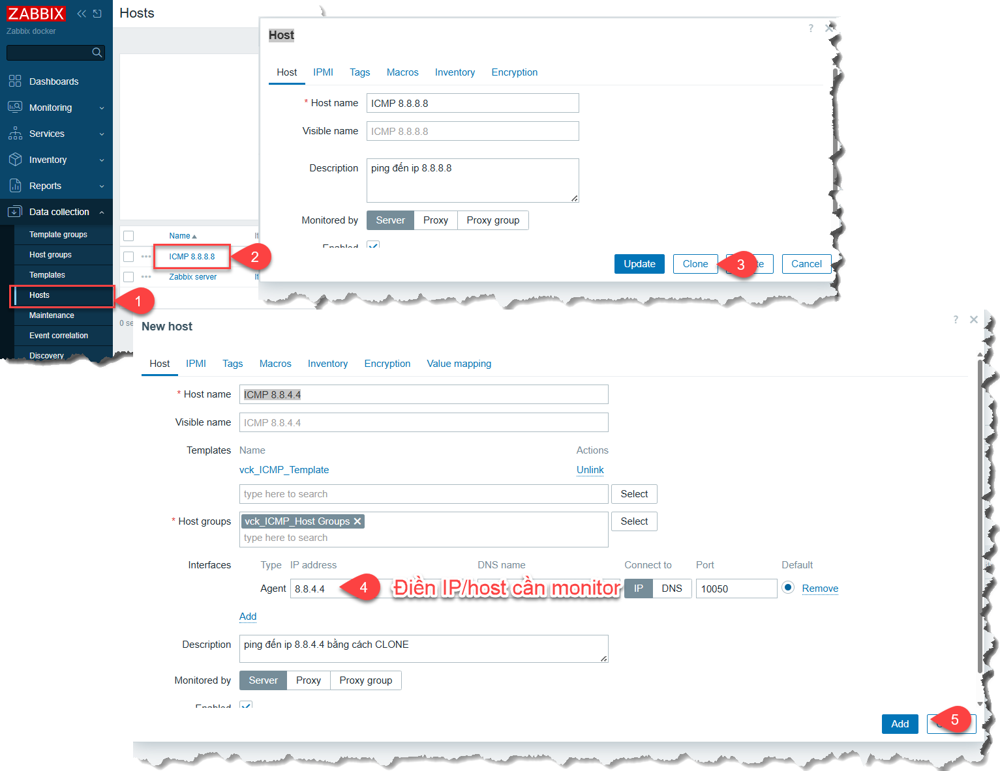

## CẤU HÌNH CƠ BẢN
### 3.1 ICMP - ping
- Tạo mới `Template groups`

- Tạo mới `Host groups`

- Tạo mới `Templates`

- Tạo mới `HOST`(Đây là thiết bị cần Ping - ICMP)

- **XEM DỮ LIỆU ICMP**

- **CLONE Host**

> Tham khảo thêm tại https://khanhvc.blogspot.com/2020/09/zabbix-cau-hinh-co-ban.html