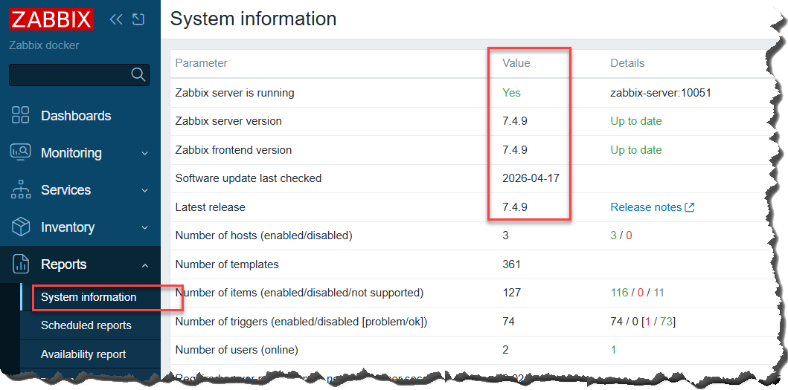
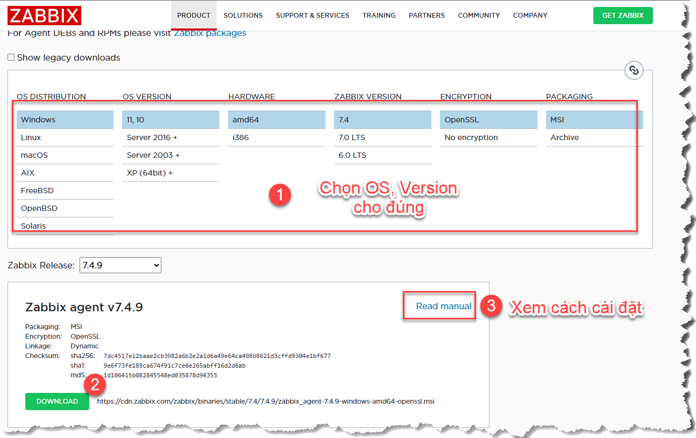
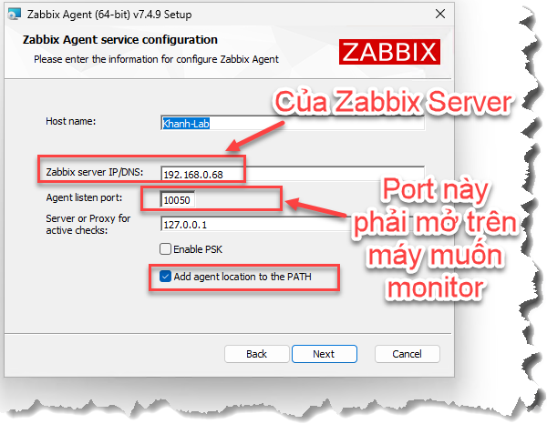
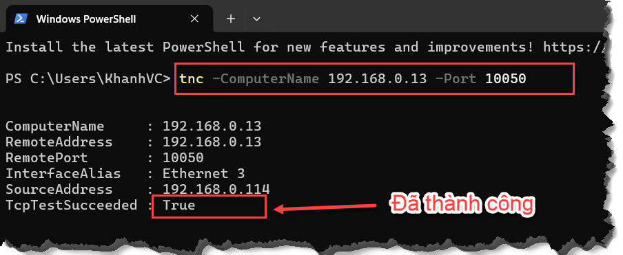
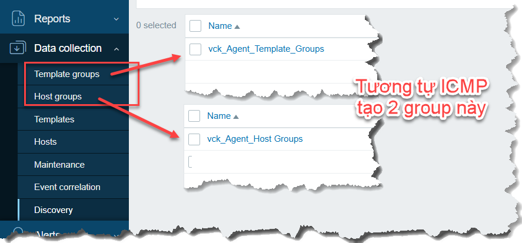
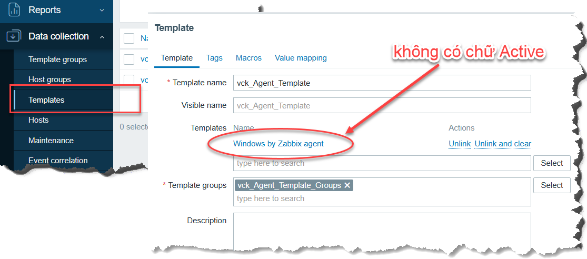
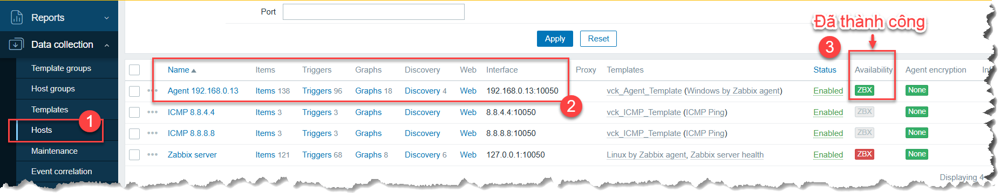
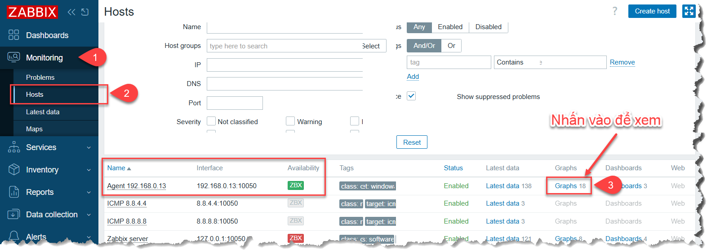
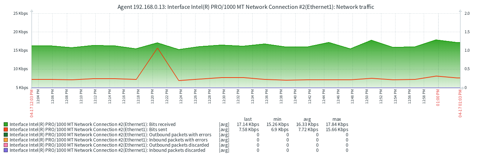
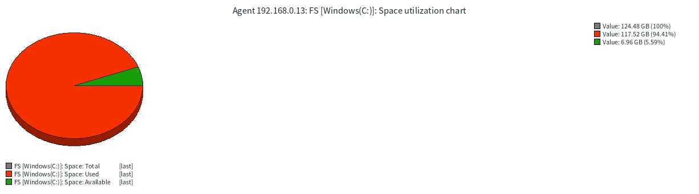

## CẤU HÌNH CƠ BẢN
### 3.2 AGENT

Dữ liệu mà Zabbix Agent có thể thu thập cực kỳ đa dạng, được chia thành các nhóm "Item keys" mặc định. Dưới đây là danh sách các nhóm dữ liệu phổ biến nhất mà bạn có thể xem được từ Agent:

1. Hiệu năng Hệ thống (System Performance)
    - CPU: Tải hệ thống (load average), phần trăm sử dụng (user, system, idle), số lượng CPU core.

    - Memory: Dung lượng RAM tổng, RAM còn trống, RAM khả dụng, dung lượng Swap.

    - Disk: Dung lượng ổ cứng (tổng, đã dùng, còn trống), tốc độ đọc/ghi dữ liệu (I/O), số lượng IOPS.

2. Trạng thái Hệ điều hành (OS Status)
    - Hệ thống: Thời gian máy chủ đã chạy (uptime), tên máy chủ (hostname), phiên bản OS, thời gian hệ thống.

    - Tiến trình (Processes): Tổng số tiến trình đang chạy, trạng thái của một tiến trình cụ thể (ví dụ: nginx hay sqlserver có đang sống không).

    - Người dùng: Số lượng người dùng đang đăng nhập vào hệ thống.

3. Mạng (Network Interface)
    - Traffic: Lưu lượng dữ liệu tải lên (In) và tải xuống (Out) trên từng card mạng.

    - Lỗi mạng: Số lượng gói tin bị lỗi (errors) hoặc bị rơi (dropped packets).

    - Kết nối: Trạng thái các port (Listen), số lượng kết nối đang thiết lập (Established).

4. Giám sát File và Nhật ký (Files & Logs)
    - File: Kiểm tra sự tồn tại của file, kích thước file, mã hash (để xem file có bị thay đổi trái phép không).

    - Log Files: Theo dõi nội dung file log theo thời gian thực, lọc các từ khóa lỗi như "Error", "Critical", "Fail" để bắn cảnh báo.

5. Dịch vụ và Ứng dụng (Services & Apps)
    - Windows Services: Trạng thái các dịch vụ (Running, Stopped, Paused).

    - Web Server: Nếu cài thêm script hoặc module, agent có thể lấy số lượng request/giây, trạng thái phản hồi.

6. Khả năng mở rộng (UserParameter)
    - Tùy biến: Đây là điểm mạnh nhất. Bạn có thể viết code (Bash, PowerShell, Python) để Agent thực thi và trả về bất cứ dữ liệu gì bạn muốn (ví dụ: đếm số dòng trong database, kiểm tra nhiệt độ phần cứng...).

**Sự khác biệt nhỏ giữa các hệ điều hành:**

- Windows: Agent có thể lấy được các chỉ số từ Performance Counter (rất chi tiết về phần cứng và dịch vụ hệ thống).

- Linux: Agent lấy dữ liệu chủ yếu từ các file trong hệ thống /proc và /sys.

#### 1. Chuẩn bị - Thực hiện trên máy cần monitor
1. Xác định version đang dùng



2. Download Agent
Truy cập vào trang https://www.zabbix.com/download_agents chọn OS, version thích hợp



Cách cài đặt Agent trên window từ trang chủ https://www.zabbix.com/documentation/7.4/en/manual/installation/install_from_packages/win_msi

3. Cài đặt như phần mềm bình thường, điền **địa chỉ IP máy chủ Zabbix** và **port 10050** để server kết nối vào máy cần monitor để thu thập dữ liệu (gọi là chế độ **Passive**)



4. Thêm port 10050 vào máy cần monitor
```powershell
New-NetFirewallRule -DisplayName "_Zabbix_Agent" `
    -Direction Inbound `
    -Action Allow `
    -Protocol TCP `
    -LocalPort 10050 `
    -Description "Cho phép Zabbix Server kết nối tới Agent để lấy dữ liệu"
```
> *Giải thích các tham số:*
> - **DisplayName** "_Zabbix_Agent": Tên hiển thị của quy tắc trong giao diện Windows Firewall.
> - **Direction Inbound**: Áp dụng cho lưu lượng đi vào máy tính (Server hỏi - Agent trả lời).
> - **Action Allow**: Cho phép kết nối.
> - **Protocol TCP**: Zabbix sử dụng giao thức TCP để truyền tải dữ liệu.
> - **LocalPort 10050**: Port mặc định của Zabbix Agent.
>


5. Kiểm tra port đã mở thành công chưa

```powershell
tnc -ComputerName 192.168.0.13 -Port 10050
```



#### 2. Cài đặt trên Zabbix Server
- Tương tự IMCP tạo 2 Group (Template groups và Host groups)



- Tương tự tạo Template cho Window Agent (Mode **Passive Agent**)



- Kết quả đã cấu hình



#### 3. Xem kết quả monitor




- Một số biểu đồ minh họa

    - Card mạng

    

    - HDD

    


> Có thể tham khảo bài viết khác tại đây https://khanhvc.blogspot.com/2020/09/zabbix-cau-hinh-zabbix-co-ban-agent.html