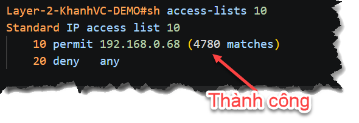
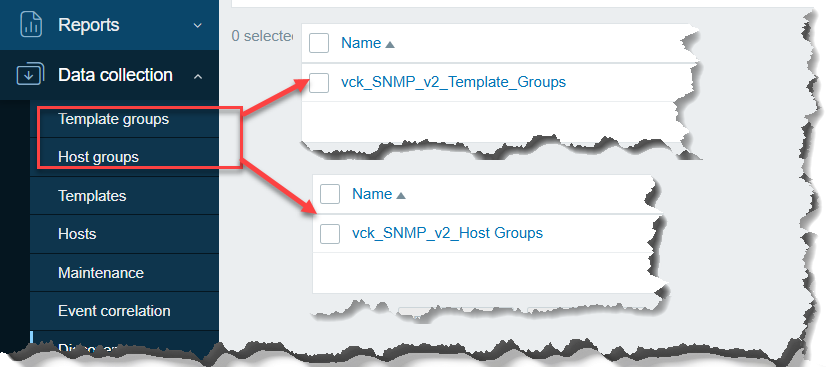
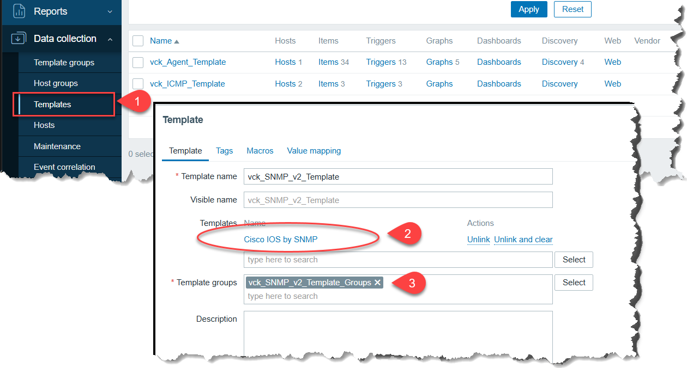
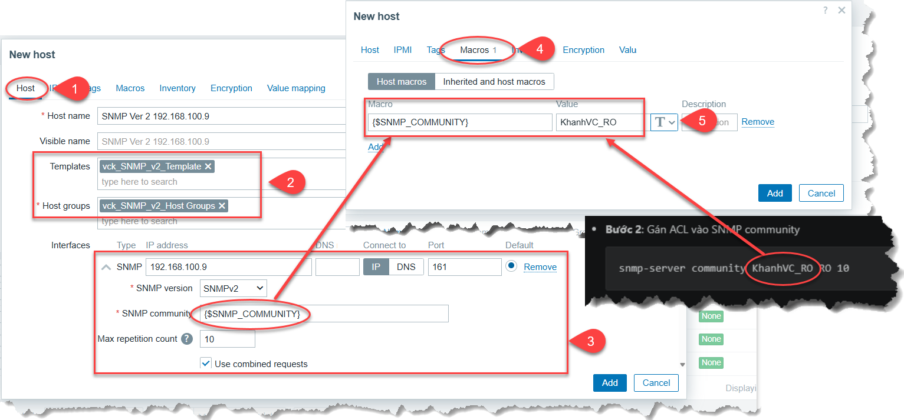
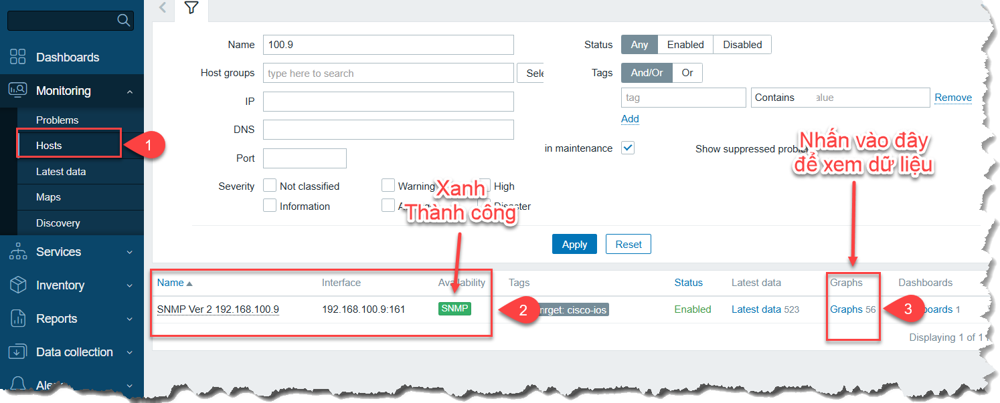
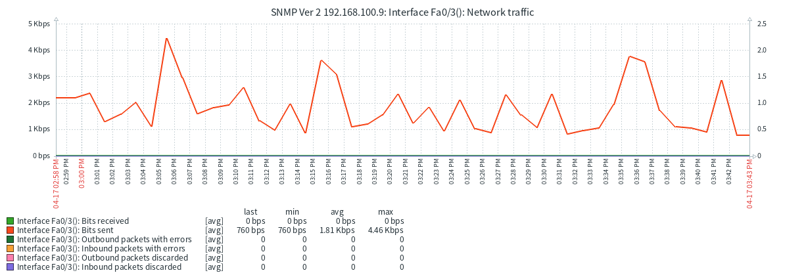
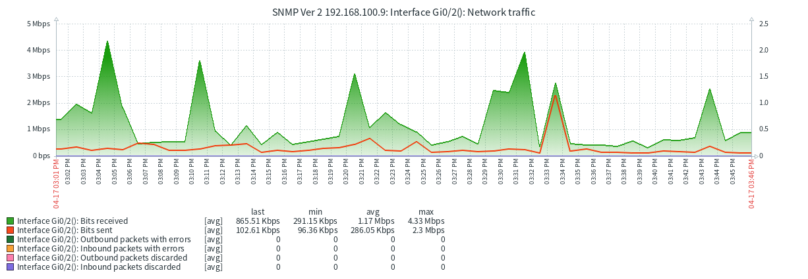

## CẤU HÌNH CƠ BẢN
### 3.3 SNMP
#### 3.3.1 Tổng quan:
**SNMP (Simple Network Management Protocol)** là một giao thức tiêu chuẩn giúp các thiết bị mạng "nói chuyện" với nhau để phục vụ mục đích quản lý và giám sát.

**Nói một cách đơn giản nhất:**

- **Mục đích**: Giúp bạn quản lý tập trung hàng trăm thiết bị (Switch, Router, Server, Máy in...) từ một màn hình duy nhất mà không cần đến tận nơi kiểm tra.

- **Cách thức**: Nó giống như một bộ câu hỏi - câu trả lời. Trình quản lý (Manager) gửi câu hỏi, và thiết bị (Agent) sẽ tra cứu trong "cuốn từ điển" của nó (gọi là **MIB**) để trả lời kết quả.

**3 Thành phần chính:**
1. **SNMP Manager (Trình quản lý)**: Phần mềm trung tâm (như Zabbix, PRTG) dùng để thu thập và hiển thị dữ liệu.

2. **SNMP Agent (Đại lý)**: Một phần mềm nhỏ chạy sẵn trên thiết bị (Switch, UPS, Server...) để thu thập thông tin nội bộ.

3. **MIB & OID**: "Cuốn từ điển" và "Số trang". Mỗi chỉ số (như nhiệt độ, tốc độ quạt) sẽ có một mã số riêng gọi là OID để Manager biết chính xác nó đang hỏi về cái gì.

**Các phiên bản phổ biến:**
- **v1 & v2c**: Dễ dùng nhưng bảo mật kém (chỉ dùng một mật khẩu đơn giản gọi là Community String).

- **v3**: Bảo mật nhất, hỗ trợ mã hóa và xác thực người dùng (khuyên dùng cho các hệ thống hiện đại).

**PORT mặc định:**

- **161 (UDP)**: Dùng để Zabbix Server lấy dữ liệu từ thiết bị.

- **162 (UDP)**: Dùng để thiết bị tự động đẩy cảnh báo (Traps) về Server.

#### 3.3.2 So sánh và khuyên dùng:
1. **So sánh:**

| Tiêu chí            | Zabbix Agent (Khuyên dùng)                                                                 | SNMP (Giao thức mạng)                                                                 |
|--------------------|--------------------------------------------------------------------------------------------|----------------------------------------------------------------------------------------|
| Độ chi tiết        | Rất cao. Lấy được mọi thứ từ Performance Counter, Event Log, WMI, Services...              | Trung bình. Chỉ lấy được các chỉ số cơ bản (CPU, RAM, Traffic) qua các OID.            |
| Tính năng đặc biệt | Có thể đọc file Log, chạy script tùy biến (PowerShell/Python).                             | Không thể đọc Log hoặc chạy script tùy biến.                                           |
| Chế độ hoạt động   | Hỗ trợ cả Passive và Active (đẩy dữ liệu qua NAT/Firewall).                                | Chủ yếu là Passive (Server phải chủ động hỏi).                                         |
| Tải hệ thống       | Rất nhẹ, được tối ưu riêng cho Zabbix.                                                      | Có thể gây tải CPU nếu truy vấn quá nhiều OID cùng lúc.                                |
| Cài đặt            | Phải cài thêm phần mềm Agent lên máy Client.                                                | Không cần cài thêm (Windows có sẵn tính năng SNMP Service).                            |

2. **Tại sao nên chọn Zabbix Agent?**
Dưới đây là 3 lý do "chí mạng" khiến Agent luôn thắng SNMP khi giám sát Windows:

- **Khả năng đọc Event Log**: Đây là thứ quan trọng nhất trên Windows. Agent có thể báo ngay cho bạn khi có ai đó đăng nhập sai (Brute force) hoặc một dịch vụ bị crash. SNMP gần như "bó tay" với việc phân tích Log chi tiết.

- **Sử dụng WMI và Performance Counters**: Agent có thể truy cập sâu vào Windows Management Instrumentation (WMI). Bạn có thể check trạng thái cụ thể của SQL Server, Exchange, hay thậm chí là nhiệt độ ổ cứng thông qua các câu lệnh PowerShell tích hợp.

- **Độ bảo mật và Linh hoạt**: Agent hỗ trợ mã hóa (TLS/PSK) và có thể tự chủ động đẩy dữ liệu lên Server (Active Mode). Điều này cực kỳ hữu ích nếu máy Client của bạn nằm trong một mạng riêng mà bạn không muốn mở port "khơi khơi" cho bên ngoài vào.

3. **Khi nào thì mới dùng SNMP?**
Bạn chỉ nên dùng SNMP trên Windows khi:

- **Chính sách bảo mật cực đoan**: Không cho phép cài bất cứ phần mềm thứ 3 nào (Agent) lên máy chủ.

- **Thiết bị không cài được Agent**: Như Switch, Router, Máy in, hoặc các thiết bị lưu trữ (NAS) đóng gói sẵn của hãng.

#### 3.3.3 Cấu hình
#### 3.3.3.1 **Cấu hình SNMP trên Cisco IOS:**

> **Kịch bản:**
> - Server Zabbix có IP: 192.168.0.68
> - Cisco Switch có IP: 192.168.100.9
> - Phải đảm bào 2 thiết bị có thế thông mạng nếu khác vlan

> 1.1 **Yêu cầu:**
> - Chỉ **cho phép duy nhất** server Zabbix 192.168.0.68 được phép query **SNMP** trên Cisco IOS

> 1.2 **Hướng thực hiện:** 
> - **Kết hợp SNMP community** + **ACL**

**CẤU HÌNH:**
##### - **Version 2:**

**Thực hiện trên thiết bị muốn monitor**

- **Bước 1**: Tạo ACL chỉ cho phép server Zabbix
    ```bash
    conf t
    access-list 10 permit 192.168.0.68
    access-list 10 deny any
    ```
- **Bước 2**: Gán ACL vào SNMP community
    ```bash
    snmp-server community KhanhVC_RO RO 10
    ```

- *Giải thích:*
    - KhanhVC_RO = community string (password SNMP)
    - RO = read-only (chuẩn, không dùng RW)
    - 10 = ACL chỉ cho phép IP trên (0.68)

**TEST**

**Thực hiện trên Zabbix Server 0.68**
```bash
# cài gói snmp - mục đích để test là chính
sudo apt update
sudo apt install -y snmp
```

Thực hiện test
```bash
snmpwalk -v2c -c KhanhVC_RO 192.168.100.9
```
**Thực hiện trên thiết bị 100.9**

```bash
Layer-2-KhanhVC-DEMO#sh access-lists 10
Standard IP access list 10
    10 permit 192.168.0.68 (4780 matches)
    20 deny   any

```
Nếu thành công chúng ta thấy có **số lương gói tin matches**



**THÊM HOST 192.168.100.9 VÀO Zabbix**

- Tạo template group và Host groups



- Tạo template cho SNMP - Cisco IOS



- **ADD Host**



- **KẾT QUẢ**



- Dữ liệu có dạng:





###### **Version 3**:

- **Bước 1**: Tạo group

```bash
conf t
snmp-server group ZABBIX v3 priv
```

- **Bước 2**: Tạo user
```bash
snmp-server user zabbix ZABBIX v3 auth sha AuthPass123 priv aes 128 PrivPass123
```

👉 Giải thích:
> - zabbix = username
> - ZABBIX = group
> - auth sha = xác thực
> - priv aes 128 = mã hóa

**(Khuyến nghị) Bước 3**: Giới hạn IP bằng ACL
```bash
access-list 10 permit 192.168.0.68
snmp-server group ZABBIX v3 priv access 10
```

- **(Optional) Bước 4**: Khai báo host nhận trap
```bash
snmp-server host 192.168.0.68 version 3 priv zabbix
```

- **CẤU HÌNH ĐẦY ĐỦ**
```bash
conf t

access-list 10 permit 192.168.0.68

snmp-server group ZABBIX v3 priv access 10
snmp-server user zabbix ZABBIX v3 auth sha AuthPass123 priv aes 128 PrivPass123

end
wr
```
> Tham khảo thêm một số bài viết khác
> - https://khanhvc.blogspot.com/2020/09/zabbix-cau-hinh-zabbix-co-ban-snmp.html
> - https://khanhvc.blogspot.com/2020/03/simple-network-management-protocol-snmp.html
