## CẤU HÌNH CƠ BẢN
### 3.4.1 SQL và Agent (không hỗ trợ Agent 2)

- Demo trên Windows 2012 R2 + SQL Server 2008 R2, IP: 192.168.99.17
#### 1. Tải và cài Agent tương ứng với OS của Server

- Cài đặt và thêm port tương tự như mục 02-Agent
- Đảm bảo **SQL Server Native Client** đã được cài đặt

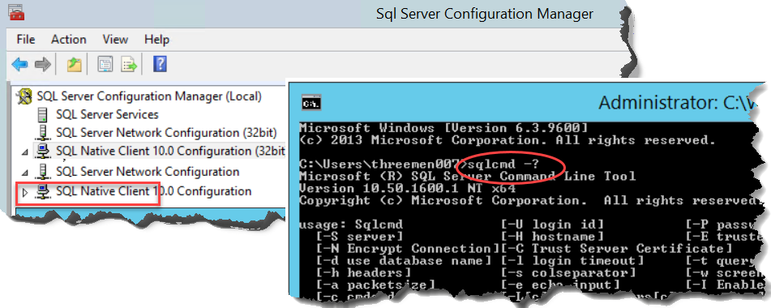

- Enable TCP/IP -> Fix port 1433

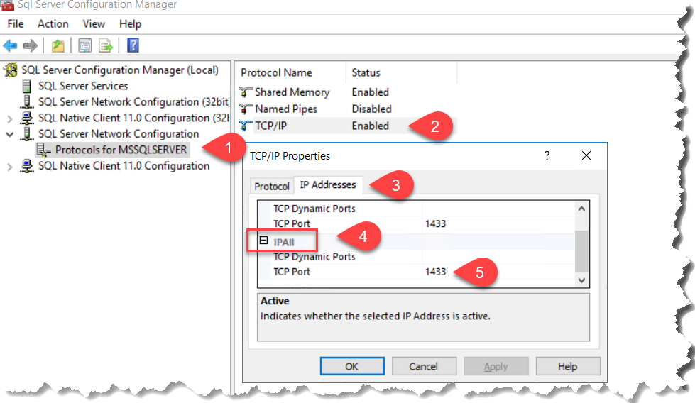
#### 2. Tạo user trên SQL vào phân quyền cho user:

1. Mở SQL Server Management Studio và thực thiện 

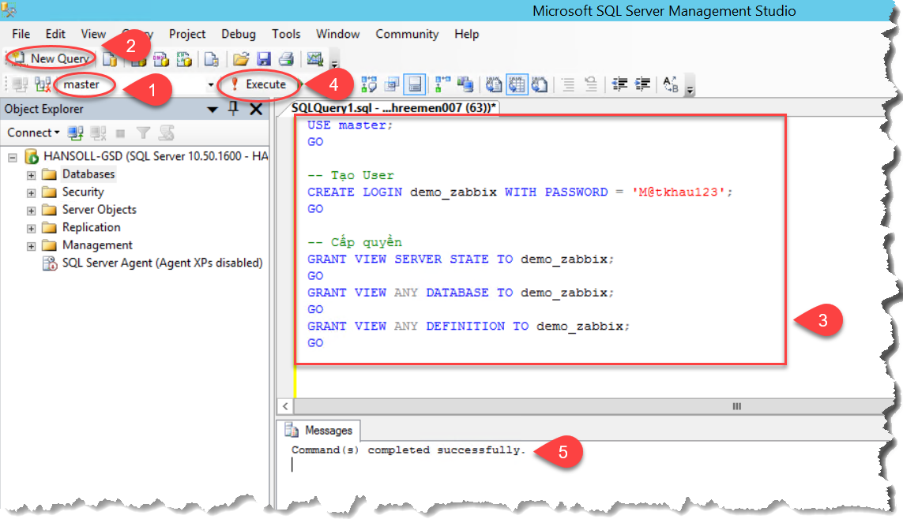

2. Code T-SQL (dán vào chỗ số 3)
```tsql
USE master;
GO

-- Tạo User có tên demo_zabbix và mật khẩu là M@tkhau123
CREATE LOGIN demo_zabbix WITH PASSWORD = 'M@tkhau123';
GO

-- Cấp quyền
GRANT VIEW SERVER STATE TO demo_zabbix;
GO
GRANT VIEW ANY DATABASE TO demo_zabbix;
GO
GRANT VIEW ANY DEFINITION TO demo_zabbix;
GO
```

#### 3. Monitor phần cốt lõi cho SQL

##### 1. Mục đích
| Chỉ số (Metric) | Câu lệnh T-SQL                                                         | Mục đích                                                                                  |
| --------------- | ---------------------------------------------------------------------- | ----------------------------------------------------------------------------------------- |
| **Load**        | `SELECT COUNT(*) FROM sys.dm_exec_sessions`  | Theo dõi số kết nối người dùng hiện tại để đánh giá tải hệ thống và phát hiện bất thường. |
| **Storage**     | `SELECT ISNULL(SUM(size)*8/1024,0) AS [Size_MB] FROM sys.master_files` | Theo dõi tổng dung lượng database để kiểm soát tăng trưởng và tránh đầy ổ đĩa.            |
| **Stability**   | `SELECT DATEDIFF(SECOND, sqlserver_start_time, GETDATE()) FROM sys.dm_os_sys_info`                  | Xác định thời điểm khởi động SQL để phát hiện restart hoặc sự cố hệ thống.                |

##### 2. TEST câu T-SQL:

Từng câu lệnh T-SQL trong bảng, đảm bảo phải chạy trả về kết quả (kết quả trả về là số, tùy dữ liệu của server)

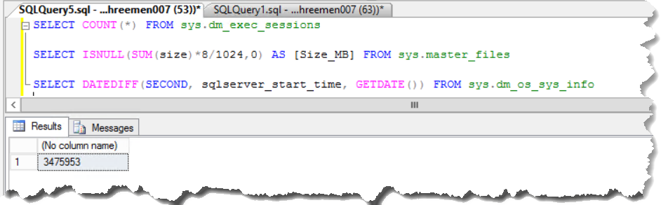

##### 3. Tạo các file Power Shell tương ứng
> thêm 'SET NOCOUNT ON; ' trước mỗi câu lệnh T-SQL ở bảng trên
> Các file lưu vào thư mục đặt tên không có khoảng trắng, ví dụ: C:\Zabbix\scripts

- Tạo file sql_connection.ps1:

```powershell
$server = "localhost"
$user = "demo_zabbix"
$password = "M@tkhau123"

$query = "SET NOCOUNT ON; SELECT COUNT(*) FROM sys.dm_exec_sessions"

$result = sqlcmd -S $server -U $user -P $password -Q $query -h -1 -W

if ($result) {
    [string]$result = $result
    Write-Output $result.Trim()
} else {
    Write-Output 0
}
```

- Tạo file sql_dbsize.ps1:

```powershell
$server = "localhost"
$user = "demo_zabbix"
$password = "M@tkhau123"

$query = "SET NOCOUNT ON; SELECT ISNULL(SUM(size)*8/1024,0) FROM sys.master_files"

$result = sqlcmd -S $server -U $user -P $password -Q $query -h -1 -W

# lọc lấy dòng chứa số
$result = $result | Where-Object { $_ -match '^\d+' }

if ($result) {
    $result = $result | Select-Object -First 1
    $result.ToString().Trim()
} else {
    0
}
```

- Tạo file sql_uptime.ps1:

```powershell
$server = "localhost"
$user = "demo_zabbix"
$password = "M@tkhau123"

$query = "SET NOCOUNT ON; SELECT DATEDIFF(SECOND, sqlserver_start_time, GETDATE()) FROM sys.dm_os_sys_info"

# $result = sqlcmd -S $server -U $user -P $password -Q $query -h -1 -W
$result = sqlcmd -S $server -U $user -P $password -Q $query -h -1 -W

if ($result) { $result.Trim() } else { 0 }
```

Đảm bảo các file .PS1 phải trả về kết quả

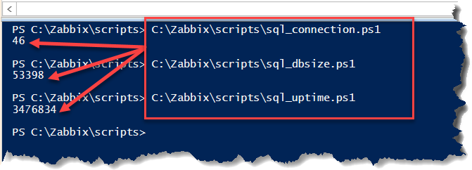

##### 5. Tinh chỉnh file zabbix_agentd.conf
> Thông thường C:\Program Files\Zabbix Agent

```conf
# Hiện tại là 127.0.0.1 CHỈNH thành địa chỉ server zabbix
Server=192.168.0.68
ServerActive=192.168.0.68

# THÊM vào cuối file
### SQL Server monitoring

UserParameter=sql.connections,powershell -NoProfile -ExecutionPolicy Bypass -File C:\zabbix\scripts\sql_connection.ps1

UserParameter=sql.dbsize,powershell -NoProfile -ExecutionPolicy Bypass -File C:\zabbix\scripts\sql_dbsize.ps1

UserParameter=sql.uptime,powershell -NoProfile -ExecutionPolicy Bypass -File C:\zabbix\scripts\sql_uptime.ps1

```

##### 6. Khởi động lại Zabbix Agent

```bat
net stop "Zabbix Agent"
net start "Zabbix Agent"
```
##### 7. Test kết nối đến SQL từ Zabbix server

```shell
sudo docker exec zabbix-server zabbix_get -s 192.168.99.17 -k sql.connections

sudo docker exec zabbix-server zabbix_get -s 192.168.99.17 -k sql.dbsize

sudo docker exec zabbix-server zabbix_get -s 192.168.99.17 -k sql.uptime
```

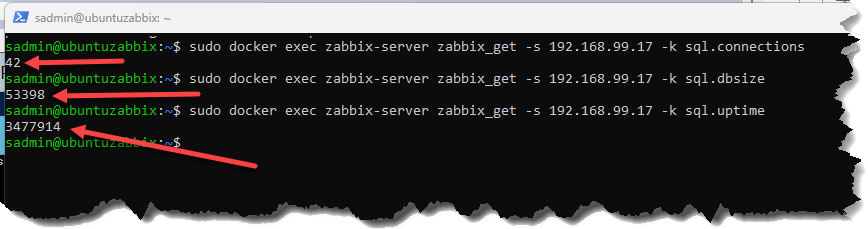

##### 8. Thực hiện add host trên Zabbix

1. CPU, RAM, HDD, Băng thông tương tự trước mục 2

2. Templates không chọn để định nghĩa sau

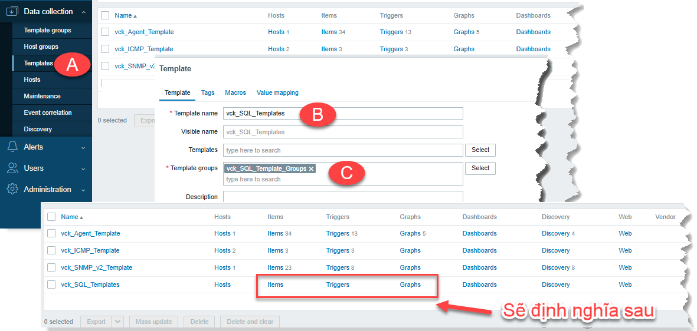

3. **Thêm Item**

**sql.connections** là Para trong file Zabbix_Agent.conf

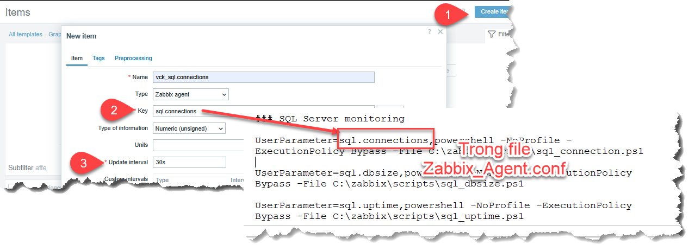

Tương tư cho **sql.uptime** và **sql.dbsize**

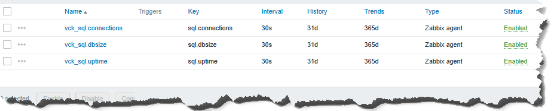

4. **Thêm Graphs**

- Connection

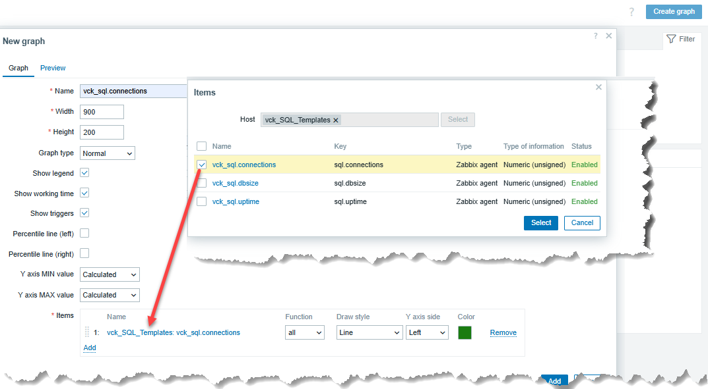

- Tượng tự cho các Para còn lại

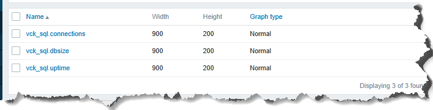


5. **Thêm Triggers**

- Connection nếu số **connections tại 1 thời điểm** > 40 (số này tùy mình thiết lập) thì cảnh bảo

```bat
last(/vck_SQL_Templates/sql.connections)>40
```

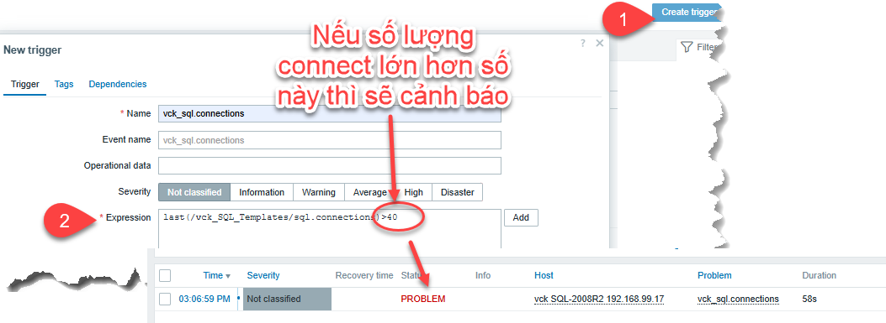

6. Add host như bình thường

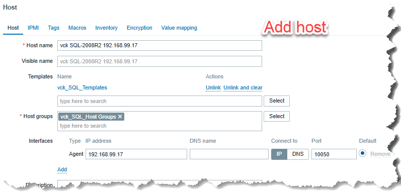


7. Kết quả có dạng

- Sau khi thêm Item, Trigger, Graphs bằng tay

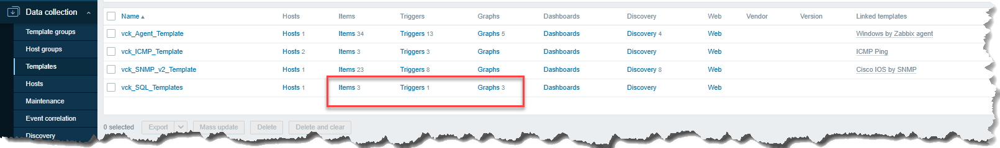

- Kết quả monitor

Đường màu đen là **ngưỡng (40) chúng ta thiết lập**

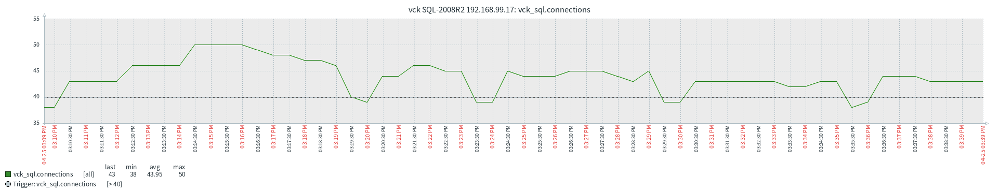


- Cảnh báo

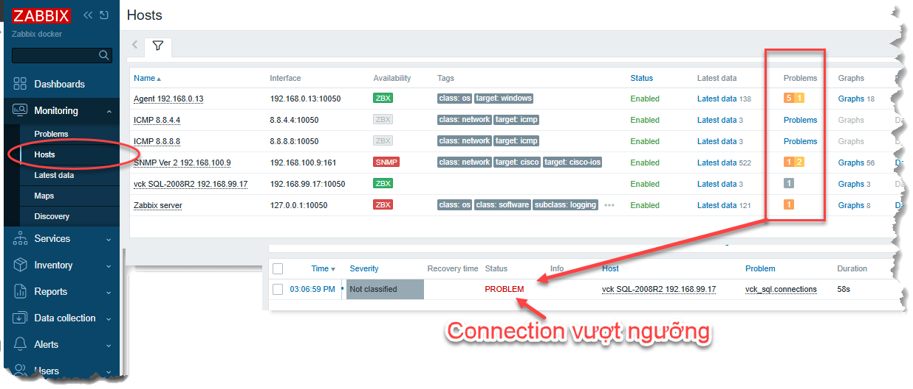

### 3.4.2 Agent 2 SQL