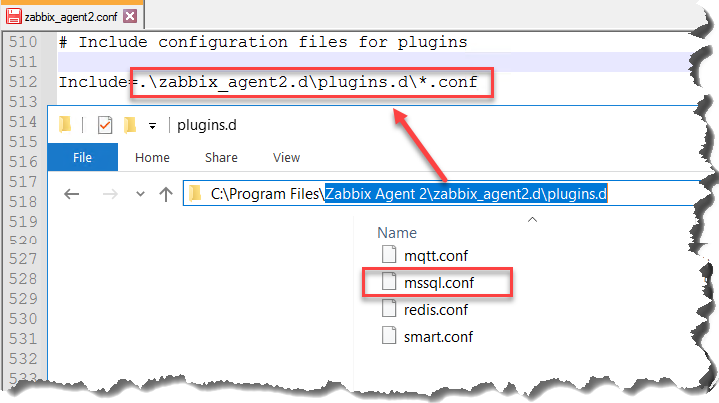
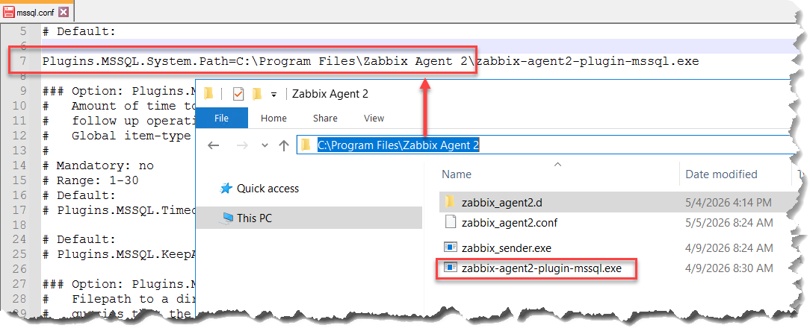
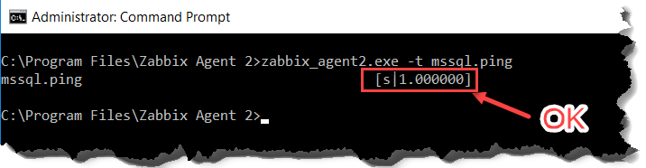
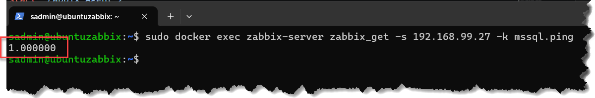
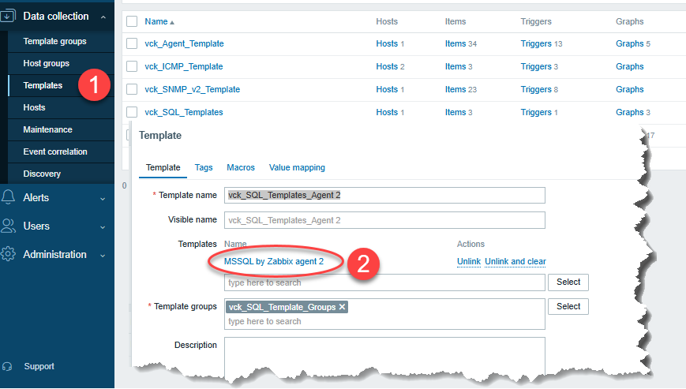
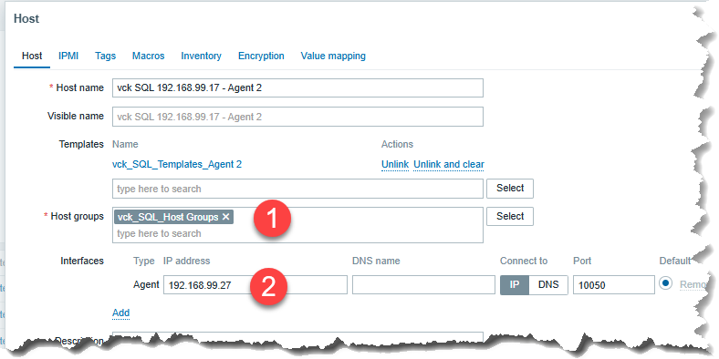
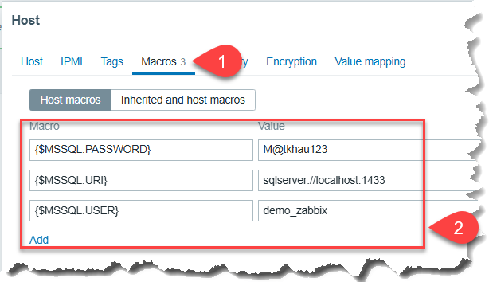
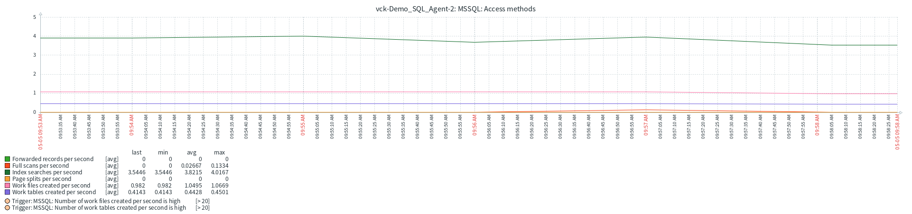
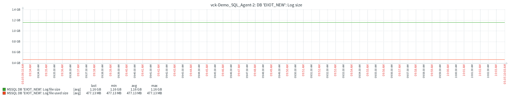

### 3.4.2 Agent 2 SQL

>  Demo
> - Windows 2016+
> - SQL Server 2014 SP3 hoặc cao hơn
> - tham khảo https://www.zabbix.com/integrations/mssql
> - SQL Server IP: 192.168.99.27
> - Zabbix Sderver IP: 192.168.0.68

https://www.youtube.com/watch?v=eJPe_4D_KH0

#### 0. Enable TCP/IP & Fix port 1433
- Fix port


- Thêm port 1433 vào máy SQL Server

```powershell
New-NetFirewallRule -DisplayName "_SQL_Server" `
    -Direction Inbound `
    -Action Allow `
    -Protocol TCP `
    -LocalPort 1433 `
    -Description "Cho phép kết nối tới SQL Server"
```

#### 1. Tạo user cho Zabbix trên SQL Server

```tsql
CREATE LOGIN demo_zabbix WITH PASSWORD = 'M@tkhau123';
GRANT VIEW SERVER STATE TO demo_zabbix
GRANT VIEW ANY DEFINITION TO demo_zabbix
USE msdb
CREATE USER demo_zabbix FOR LOGIN demo_zabbix
GRANT EXECUTE ON msdb.dbo.agent_datetime TO demo_zabbix
GRANT SELECT ON msdb.dbo.sysjobactivity TO demo_zabbix
GRANT SELECT ON msdb.dbo.sysjobservers TO demo_zabbix
GRANT SELECT ON msdb.dbo.sysjobs TO demo_zabbix
GO
```

#### 2. Tải Zabbix agent 2
- Tìm tải **Zabbix agent 2** https://www.zabbix.com/download_agents thích hợp
- Tải **Plugin MSSQL** https://cdn.zabbix.com/zabbix/binaries/stable/ thích hợp OS, Version
- Cài đặt nhưng bình thường

#### 3. Chỉnh file Cấu hình

- File **zabbix_agent2.conf**
> Tại đường dẫn `C:\Program Files\Zabbix Agent 2\zabbix_agent2.conf`

```conf
# sửa 
Hostname=vck-Demo_SQL_Agent-2 # phải trùng khớp với host khi tạo trên zabbix

Server=192.168.0.68
ServerActive=192.168.0.68

Include=.\zabbix_agent2.d\plugins.d\*.conf
```



- File **mssql.conf**
> Tại đường dẫn `C:\Program Files\Zabbix Agent 2\zabbix_agent2.d\plugins.d\mssql.conf`

```conf
Plugins.MSSQL.System.Path=C:\Program Files\Zabbix Agent 2\zabbix-agent2-plugin-mssql.exe
```



#### 4. Khởi động lại Zabbix Agent 2

```bat
net stop "Zabbix Agent 2"
net start "Zabbix Agent 2"
```

#### 5. Ping test

-  Từ SQL Server đến Local
```bat
zabbix_agent2.exe -t mssql.ping
```



- Từ Zabbix Server đến SQL Server

```bat
docker exec zabbix-server zabbix_get -s 192.168.99.27 -k mssql.ping
```

#### 6. Add host (khá đơn giản)



- Templates -> chọn **MSSQL by Zabbix agent 2**



- Add host -> chọn Template vừa tạo trên



- Thêm Macro

```macro
{$MSSQL.URI} = sqlserver://localhost:1433
{$MSSQL.USER} = demo_zabbix
{$MSSQL.PASSWORD} = M@tkhau123
```



#### 7. Dữ liệu có dạng






#### 8. Zabbix giúp được gì DBA: 
- **Nhìn tổng thể và khoanh vùng**:
    - CPU cao không?
    - Session tăng không?
    - Disk có spike không?

- **Zabbix KHÔNG biết được**:
    - Query nào chậm
    - Execution plan
    - Index nào thiếu

- **Dùng thêm tool ngoài**:
    - **Built-in SQL** - query nào chậm

```tsql
SELECT TOP 10
    total_elapsed_time / execution_count AS avg_time,
    execution_count,
    qs.sql_handle,
    st.text
FROM sys.dm_exec_query_stats qs
CROSS APPLY sys.dm_exec_sql_text(qs.sql_handle) st
ORDER BY avg_time DESC;
```

- **Hoặc phân tích sâu**
    - SQL Server Profiler
    - Extended Events