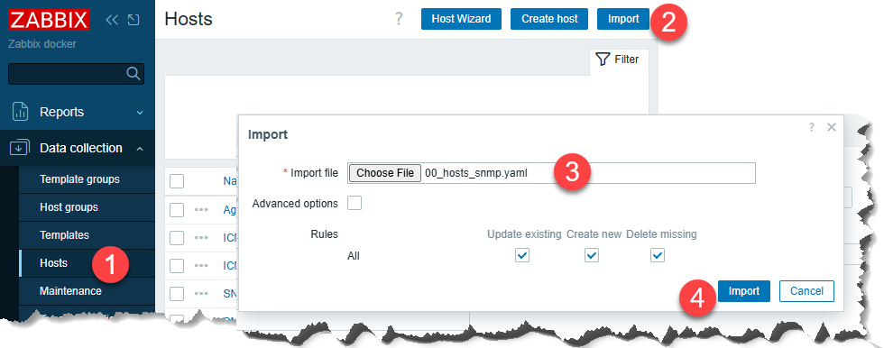

# Import danh sách ip trong CSV

1. Điền thông tin thiết bị vào file **Devices_List.csv**

2. Chạy file **generate_zabbix_hosts.ps1** bằng `Power Shell` sẽ tạo ra file **00_hosts_snmp.yaml**

3. Vào zabbix import file `00_hosts_snmp.yaml` vào

