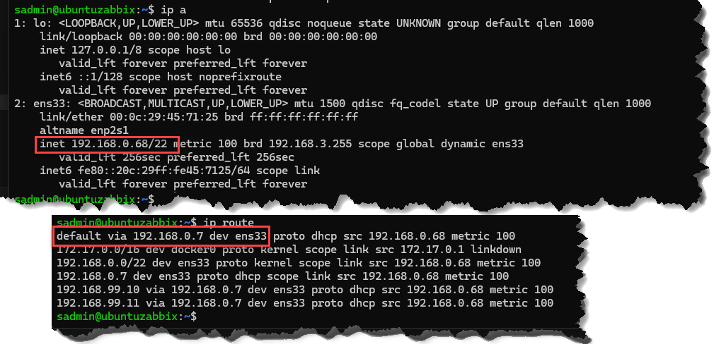

# Cấu hình căn bản
## 1. Đặt địa chỉ IP tĩnh cho Ubuntu

### Xem thông tin cấu hình IP address trong file YAML
```bash
ls /etc/netplan/
# sẽ thấy file .YAML, ví dụ: file có tên 50-cloud-init.yaml
```
- Nếu muốn chỉnh nội dung ip cần đặt. ví dụ dưới
```bash
sudo nano /etc/netplan/50-cloud-init.yaml
```
    - Soạn nội dung file như dưới
```bash
# Nội dung file .yaml đặt ip tĩnh
network:
  version: 2
  renderer: networkd
  ethernets:
    ens33:
      dhcp4: false
      addresses:
        - 192.168.0.68/22    # <- IP tĩnh cần đặt
      routes:
        - to: default
          via: 192.168.0.7    # <- Default Gateway
      nameservers:
        addresses:
          - 192.168.99.11     # <- DNS 1
          - 192.168.99.10     # <- DNS 2

# Lưu file: Nhấn Ctrl + O rồi Enter. -> Nhấn Ctrl + X để thoát     
```
- Test cấu hình (tác dụng 120 giây, nó sẽ tự động quay lại cấu hình cũ)
```bash
sudo netplan try
```

- Áp dụng chính thức
```bash
sudo netplan apply
```

- Kiểm tra ip
```bash
ip a

# hoặc
hostname -I 
```
- Kiểm tra Gateway/route
```bash
ip route
```
