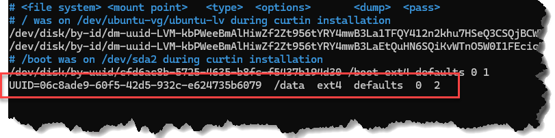
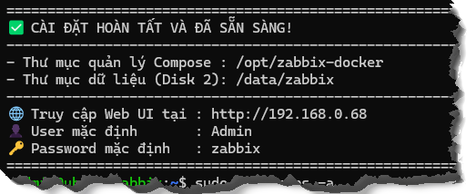
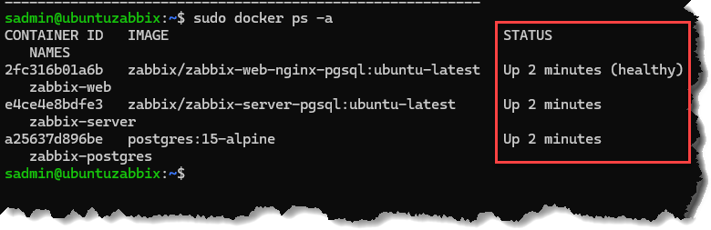

# Cài Zabbix trên Ubuntu với docker-compose
## I. CẤU TRÚC - MAPPING
### 1. Yêu cầu:
- RAM: 8Gb
- CPU: 4
- Card mạng: 1 - Brigde (nếu vmware)
- Cấu trúc disk/đĩa
```bash
/dev/sda → OS disk (40GB) - Chỉ hệ điều hành Ubuntu OS
/dev/sdb → DATA disk (200GB) - Dữ liệu Docker và Zabbix
```
### 2. Chi tiết từng đĩa
#### 2.1. Disk 1 – OS (40GB)
```bash
/dev/sda
├── /boot     ~2GB
├── /         ~30GB   ← Ubuntu + system
└── swap      ~4GB
```
```bash
/dev/sda (40GB)
└── /
    ├── /etc
    ├── /usr
    ├── /var (NHẸ)
    └── docker binary
```
#### 2.2. Disk 2 – DATA (200GB)
```bash
/dev/sdb (200GB)
└── /data
    ├── docker/                ← toàn bộ container
    └── zabbix/
        ├── postgres/          ← DB (to nhất)
        ├── server/            ← data
        └── log/               ← log
```

## II. CHUẨN BỊ
### 1. Cài Ubuntu

### Cách thêm HDD vào ubuntu
- Vào setting trên VMWare **add HDD** như bình thường
- Scan để OS nhận đĩa vừa thêm

```bash
echo "- - -" | sudo tee /sys/class/scsi_host/host*/scan
```

- **Verify Ubuntu đã thấy disk chưa**
```bash
lsblk
# kiểm dòng có chữ "sdb" đúng dung lượng vừa thêm không
```

- Kết quả
```bash    
NAME                      MAJ:MIN RM  SIZE RO TYPE MOUNTPOINTS
sda                         8:0    0   40G  0 disk
├─sda1                      8:1    0    1M  0 part
├─sda2                      8:2    0    2G  0 part /boot
└─sda3                      8:3    0   38G  0 part
  ├─ubuntu--vg-ubuntu--lv 252:0    0   30G  0 lvm  /
  └─ubuntu--vg-swap       252:1    0    4G  0 lvm  [SWAP]
sdb                         8:16   0  200G  0 disk
sr0                        11:0    1 1024M  0 rom
```

- **Format disk**
```bash
sudo mkfs.ext4 /dev/sdb
# Format disk
```

- **Mount vào /data**
```bash
sudo mkdir /data
sudo mount /dev/sdb /data
```

- **Kiểm tra**
```bash
df -h
# kết quả mong đợi có dòng 
# /dev/sdb   200G   ...   /data
```
    - Kết quả

```bash
    sadmin@ubuntuzabbix:~$ df -h
    Filesystem                         Size  Used Avail Use% Mounted on
    tmpfs                              790M  1.6M  788M   1% /run
    /dev/mapper/ubuntu--vg-ubuntu--lv   30G  2.7G   26G  10% /
    tmpfs                              3.9G     0  3.9G   0% /dev/shm
    tmpfs                              5.0M     0  5.0M   0% /run/lock
    /dev/sda2                          2.0G  104M  1.7G   6% /boot
    tmpfs                              790M   12K  790M   1% /run/user/1000
    /dev/sdb                           196G   28K  186G   1% /data
```

- **Mount tự động**
    - Lấy UUID sau đó thêm vào `fstab`
    ```bash
    sudo blkid /dev/sdb
    ```
    - Kết quả
    ```bash
    /dev/sdb: UUID="06c8ade9-60f5-42d5-932c-e624735b6079" BLOCK_SIZE="4096" TYPE="ext4"
    ```
    - Thêm vào fstab
    ```bash
    sudo nano /etc/fstab
    ```
    - Thêm vào + đóng và lưu file lại
    ```bash
    UUID=06c8ade9-60f5-42d5-932c-e624735b6079  /data  ext4  defaults  0  2
    ```



- **Test lại**
```bash
sudo umount /data
sudo mount -a
df -h

# kết quả mong đợi phải có dòng
# /dev/sdb   200G   ...   /data
```

- Reboot lại server
```bash
sudo shutdown -r now
```

- Kết quả MONG ĐỢI phải như dưới và đảm bảo sdb phải MOUNT **`tự động`**
```bash
sadmin@ubuntuzabbix:~$ lsblk
NAME                      MAJ:MIN RM  SIZE RO TYPE MOUNTPOINTS
sda                         8:0    0   40G  0 disk
├─sda1                      8:1    0    1M  0 part
├─sda2                      8:2    0    2G  0 part /boot
└─sda3                      8:3    0   38G  0 part
  ├─ubuntu--vg-ubuntu--lv 252:0    0   30G  0 lvm  /
  └─ubuntu--vg-swap       252:1    0    4G  0 lvm  [SWAP]
sdb                         8:16   0  200G  0 disk /data
sr0                        11:0    1 1024M  0 rom
```
## III. CÀI ZABBIX:
### 1. Cài Docker
```bash
curl -s https://raw.githubusercontent.com/khanhvc-doc/zabbix/master/install_docker.sh | sudo bash
```
#### Kiểm tra đảm bảo docker cài thành công
```bash
sudo docker info | grep "Docker Root Dir"

# kết quả mong đợi
Docker Root Dir: /data/docker
```
```bash
sudo ls -l /data/docker

# kết quả mong đợi
rwx--x--x 4 root root 4096 Apr 16 04:18 buildkit
drwx--x--- 2 root root 4096 Apr 16 04:18 containers
-rw------- 1 root root   36 Apr 16 04:18 engine-id
drwx------ 2 root root 4096 Apr 16 04:18 image
drwxr-x--- 3 root root 4096 Apr 16 04:18 network
drwx------ 3 root root 4096 Apr 16 04:18 plugins
drwx------ 2 root root 4096 Apr 16 04:18 runtimes
drwx------ 2 root root 4096 Apr 16 04:18 swarm
drwx------ 2 root root 4096 Apr 16 04:18 tmp
drwx-----x 2 root root 4096 Apr 16 04:18 volumes
```

### 2. Cài Zabbix
```bash
curl -s https://raw.githubusercontent.com/khanhvc-doc/zabbix/master/install_zabbix.sh | sudo bash
```
#### Cài thành công:


#### Kiểm tra trạng thái của contrainer đảm bảo `healthy`
```bash
sudo docker ps -a
```
```bash
sadmin@ubuntuzabbix:~$ sudo docker ps -a
CONTAINER ID   IMAGE                                         COMMAND                  CREATED         STATUS                   PORTS                                                                                NAMES
2fc316b01a6b   zabbix/zabbix-web-nginx-pgsql:ubuntu-latest   "docker-entrypoint.sh"   2 minutes ago   Up 2 minutes (healthy)   0.0.0.0:80->8080/tcp, [::]:80->8080/tcp, 0.0.0.0:443->8443/tcp, [::]:443->8443/tcp   zabbix-web
e4ce4e8bdfe3   zabbix/zabbix-server-pgsql:ubuntu-latest      "/usr/bin/docker-ent…"   2 minutes ago   Up 2 minutes             0.0.0.0:10051->10051/tcp, [::]:10051->10051/tcp                                      zabbix-server
a25637d896be   postgres:15-alpine                            "docker-entrypoint.s…"   2 minutes ago   Up 2 minutes             5432/tcp   
```


### 3. Thông tin đăng nhập mặt định:
- **URL**: http:// < là địa chỉ IP của Ubuntu >
- **ID/Password**: Admin/zabbix